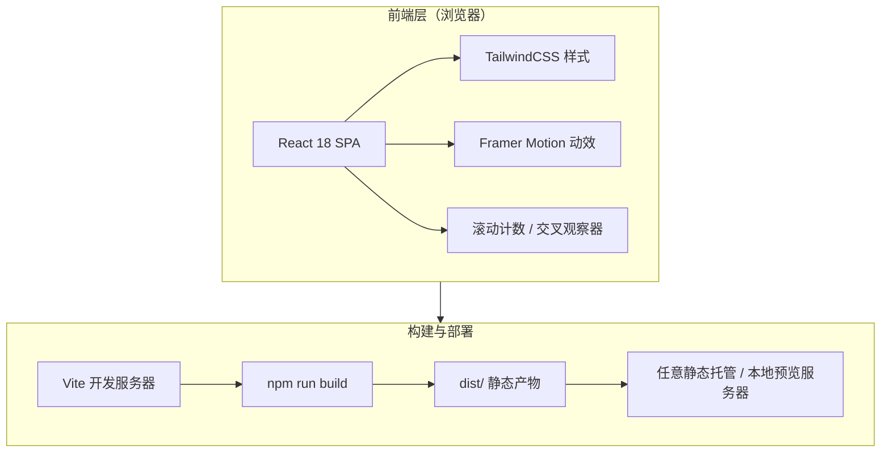

# 技术架构文档 —— MERIDIAN 落地展示页

## 1. 架构设计
纯前端单页应用，无后端、无数据库、无外部服务。构建产物为静态资源，可托管于任意静态服务器或 CDN。



## 2. 技术说明
- **前端**：React@18 + TailwindCSS@3 + Vite@5
- **动效**：Framer Motion（入场交错、滚动渐入、悬停微交互）
- **字体**：Fraunces（标题）+ Space Grotesk（正文），通过 Google Fonts / @fontsource 引入
- **初始化工具**：Vite `react-ts` 模板
- **后端**：无
- **数据库**：无
- **图标**：内联 SVG，避免外部图标库依赖

## 3. 路由定义
| 路由 | 用途 |
|------|------|
| `/` | 落地页单页，包含全部章节（导航 / Hero / 信任栏 / 特性 / 流程 / 数据 / 证言 / CTA / 页脚） |

锚点跳转（同页内）：
- `#features` → 特性矩阵
- `#workflow` → 工作流程
- `#metrics` → 数据展示
- `#cta` → 行动召唤

## 4. API 定义
无后端 API。所有内容为静态文案，集中维护在组件内的数据常量中，便于后续替换。

## 5. 服务端架构
无后端，不适用。

## 6. 数据模型
无持久化数据。页面所需内容为静态数据常量，定义如下结构（TypeScript）：

```ts
// 特性卡片
interface Feature {
  id: string;
  index: string;       // 装饰编号 "01"
  icon: ReactNode;     // 内联 SVG
  title: string;
  description: string;
}

// 工作流程步骤
interface WorkflowStep {
  id: string;
  step: string;        // "Step 01"
  title: string;
  description: string;
}

// 指标
interface Metric {
  id: string;
  value: number;       // 计数目标值
  suffix: string;      // "K+" / "%"
  label: string;
}
```

## 7. 构建与部署

### 7.1 本地预览
```bash
npm install
npm run dev      # 启动 Vite 开发服务器（默认 http://localhost:5173）
```

### 7.2 生产构建
```bash
npm run build    # 产出 dist/ 静态文件
npm run preview  # 本地预览生产构建
```

### 7.3 部署
`dist/` 目录可整体上传至任意静态托管平台（Vercel / Netlify / GitHub Pages / Nginx / 对象存储）。亦可在工作区内用任意静态服务器（如 `npx serve dist`）对外提供访问。
